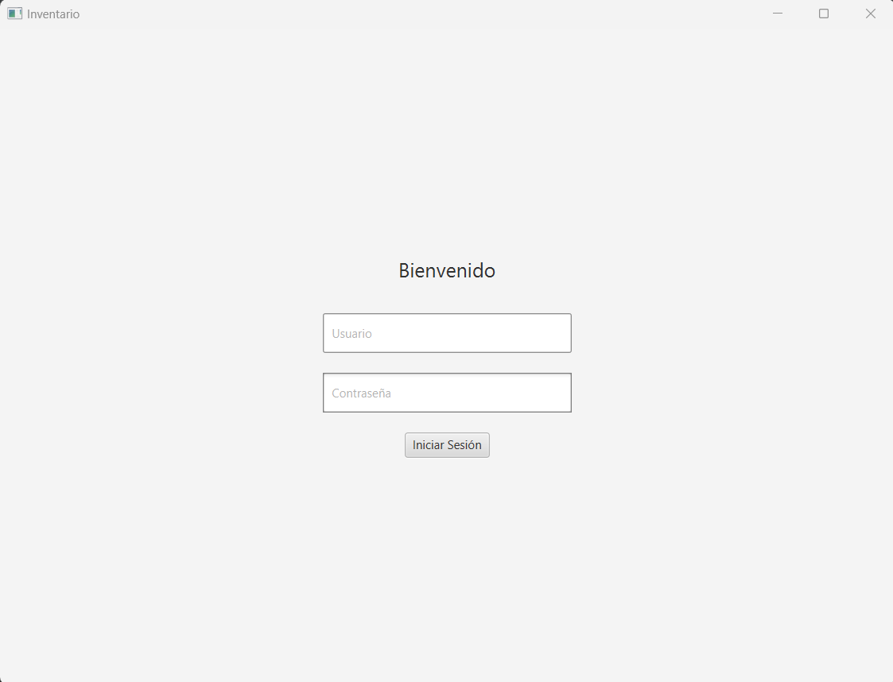
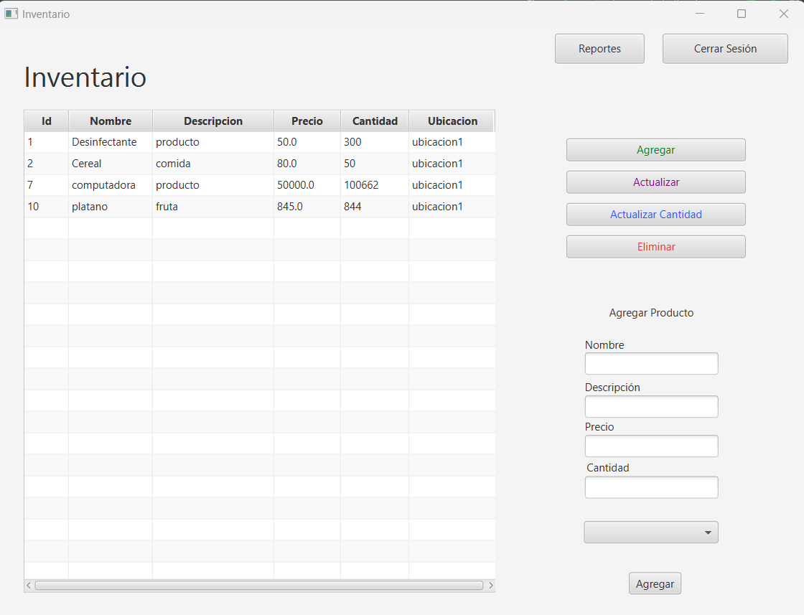
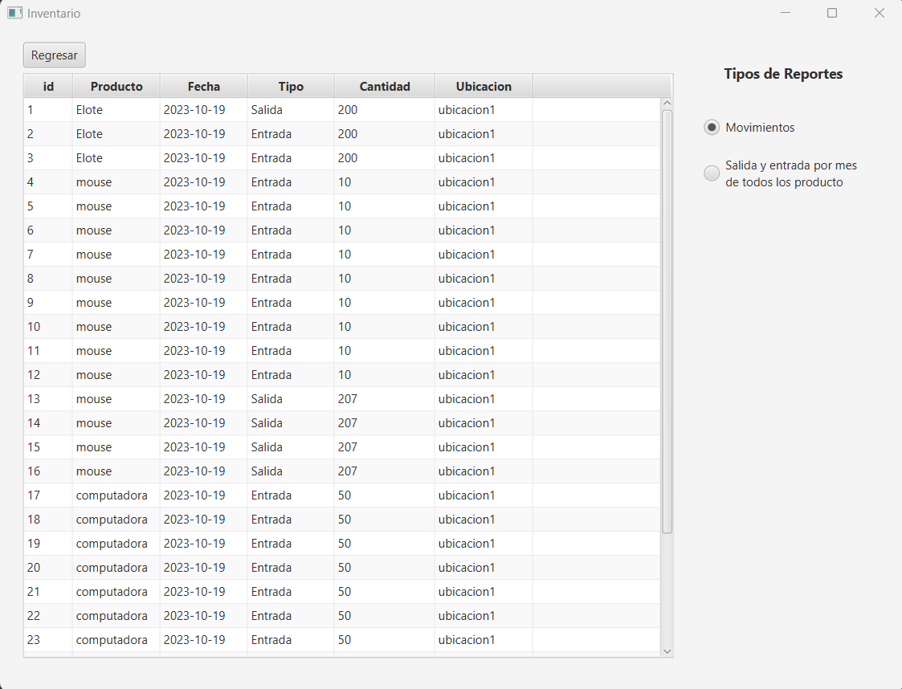

INVENTARIO

Información: Este proyecto simula un sistema de inventario, en donde se tienen varias funciones como:
1. Iniciar sesión
2. Añadir Productos
3. Eliminar productor
4. Actualizar inventario
5. Realizar reportes

**Pasos para correr el proyecto**
1. Crear Base de datos mediante el script proporcionado.
2. Asegurarse que se tenga Mysql-connector (JDBC) en las dependencias, se puede descargar en el sigueinte enlace (https://dev.mysql.com/downloads/connector/j/).
3. Asegurarse que el usuario, base de datos y contraseña sean correctas en ConexionBD.java
4. Ya que el proyecto no cuenta con la funcionalidad de añadir usuarios, se recomienda crear uno para poder iniciar sesión, al igual que una ubicación.

El archivo ejecutable se encuentra en out\artifacts\inventario_jar\inventario.jar

Pantalla 1. 

Aquí se va a iniciar sesión

Pantalla 2.

Donse se realiza las actividades de administración del inventario.

Pantalla 3. 
Se ofrece la visualización de dos reportes, uno de los movimientos que se ahn realizado y otro de los totales de entrada y salida por mes.

